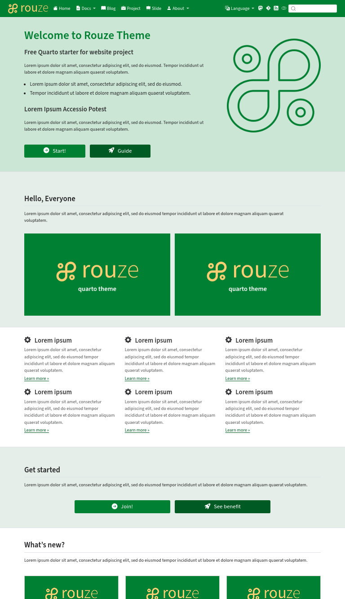
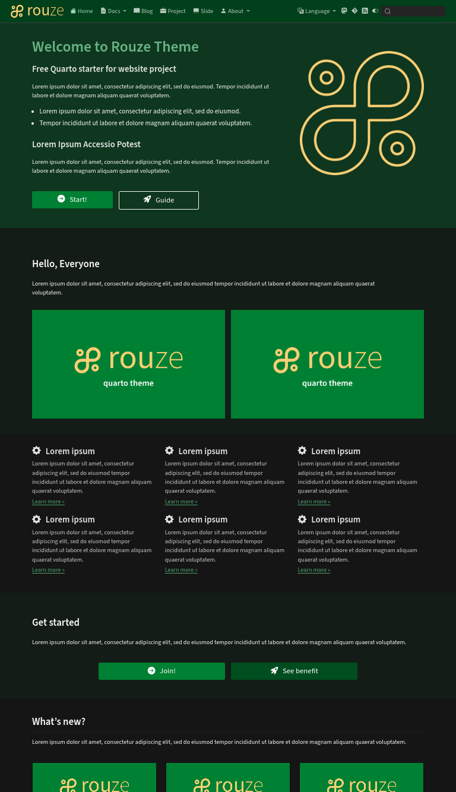

<div style="text-align:center;">
  <a href="https://rouze.hervyqa.dev" target="_blank">
    
  </a>
</div>

# Rouze Theme for Quarto

A ready‑to‑use Quarto template that ships with polished layouts for **documentation sites, blogs, presentation slides, and author pages**.  Built with multilingual support in mind - each language lives in its own `lang-<prefix>` directory.

---

## Table of Contents
1. [Features](#features)
2. [Live Demo](#live-demo)
3. [Installation](#installation)
4. [Usage](#usage)
   - [Preview locally](#preview-locally)
   - [Deploy automatically](#automatic-deploy)
5. [Multi‑language Structure](#multilanguage-structure)
6. [Project Layout](#project-layout)
7. [Contributing](#contributing)
8. [License](#license)
9. [Advanced Options](#advanced-options)

---  

## Features
- **Documentation Site**, Clean, professional layout.
- **Blog Posts**, Category‑aware markdown/blogging support.
- **Presentation Slides**, Reveal.js slides with theme switching.
- **Author Pages**, Dedicated author profile section.
- **Responsive Design**, Works on desktop, tablet, and mobile.
- **Multi‑language**, Each project can contain a folder matching `lang-<prefix>` (e.g., `lang-en`, `lang-fr`).

## Live Demo
[https://rouze.hervyqa.dev](https://rouze.hervyqa.dev)

| Light theme                  | Dark theme                  |
| :--------------------------: | :-------------------------: |
|   |   |

---

## Installation

### Clone the repository

```bash
git clone https://git.sr.ht/~hervyqa/rouze
cd rouze
```

### Install required R packages

```R
install.packages(c(
  "leaflet",
  "magick",
  "quarto"
  ))
```

> **Note**: The template works with **Quarto ≥ $1.7.34$** and **R ≥ 4.5**.

### (Optional) Install system dependencies

| Dependency | Version & Notes                                         |
|------------|-------------------------------------------------------- |
| Quarto     | `≥1.7.34`                                               |
| R          | `≥4.5`                                                  |
| TeX Live   | Optional, required for PDF generation from author pages |
| Hut        | Optional, for deploying to sourcehut pages              |
| Git        | Optional, for version control                           |

---

## Usage

### Preview locally

```bash
# Default language (e.g., English)
quarto preview lang-en

# Other languages
quarto preview lang-fr
quarto preview lang-id
quarto preview lang-ja
```

You can also start the preview from within R:

```R
library(quarto)
quarto_preview(port = 4200)
```

The site will be available at <http://localhost:4200>.

### Automatic deploy

Run the provided deployment script to publish the rendered site to **sourcehut pages** (or any custom domain you configure).

```bash
./deploy.sh
```

The script performs the following steps:

1. Accepts a domain/sub‑domain URL as an argument.
2. Removes the old `_site` build directory.
3. Renders the site with `quarto render`.
4. Packages the output into a `tar.gz` archive.
5. Publishes the archive to sourcehut pages.
6. Cleans up temporary artifacts.

---

## Multi‑language Structure

Each linguistic variant lives in its own folder prefixed with `lang-`.
Example structure for a French version:

```
my_project/
├─ lang-fr/
│  ├─ _brand.yml
│  ├─ _quarto.yml
│  ├─ about/
│  ├─ asset/        # Shared asset from lang-en (main language)
│  ├─ author/       # Listing author
│  ├─ blog/         # Listing blog
│  ├─ docs/
│  ├─ project/      # Listing project
│  ├─ slide/        # Listing slide
│  └─ index.qmd 
└─ _site/           # Export render
```

When you run `quarto preview lang-fr`, Quarto looks for the `lang-fr` directory and renders the site using that language’s source files.

---

## Project Layout

```
rouze/
├─ _site/           # Generated site output (git‑ignored)
├─ img_light.webp   # Light‑theme preview image
├─ img_dark.webp    # Dark‑theme preview image
├─ deploy.sh        # Deployment script
├─ README.md        # This file
└─ lang-*/          # Example language folders (en, fr, id, ja, …)
```
---

## Contributing

Contributions are welcome!

1. Fork the repository.
2. Create a feature branch (`git checkout -b feat/your-feature`).
3. Commit your changes with descriptive messages.
4. Open a Pull Request.

Please keep the code style consistent and run the test suite (`quarto _test`) before submitting.

---

## License

This project is licensed under the **MIT License** – see the [LICENSE](LICENSE) file for details.

---

## Advanced Options

### Custom Domains & SEO
You can point a custom domain to the generated site by editing the `CNAME` file at the root of the repository.

### Theme Switching
The template supports dark and light themes out‑of‑the‑box.  To toggle, set the `theme` option in `_quarto.yml` or add `format: revealjs: theme: dark` in your slide deck YAML.

### Adding Custom CSS
Place a file named `custom.css` inside the language folder; it will automatically be injected into the rendered pages.

