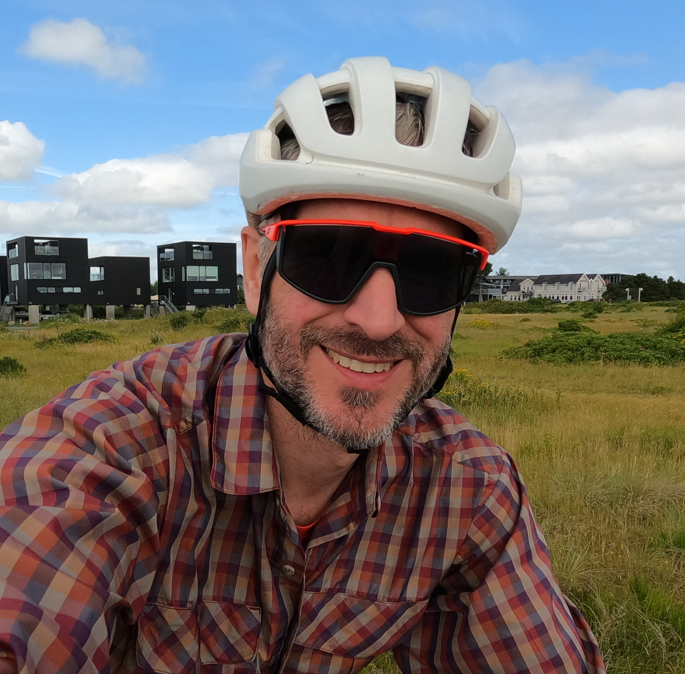

Mike is a data professional supporting organisations with leadership, research, scaling, automation and more.
His background is in climate science, and he has since worked in a range of fields including economics and sociology research, agriculture, mental health, finance and social care.
Across these domains Mike has used data skills like programming, GIS, data management, modelling, and visualisation to solve challenges and help organisations find solutions.

Mike has a PhD from the University of Edinburgh, where he studied snow hydrology.
His research was based around a historic dataset (Snow Survey of Great Britain), which he used to demonstrate a link between snow cover and climate fluctuations and better understand snow cover and melt frequency through computer simulation, machine learning and statistics.
You can read more about Mike's research on his (retired) academic blog, [scottishsnow]((https://scottishsnow.wordpress.com).

Prior to Mike's return to university he worked as a hydrologist for Environment Agency Wales and Halcrow Group Ltd.
Mike worked on projects including river and coastal flood mapping, flood defence scheme design, river re-alignment, flood forecasting (operationally and model development) and flood risk assessment.
Mike graduated from Lancaster University in 2004 with a BSc (hons) in Environmental Science.

Mike is a fellow of the [Royal Statistical Society](https://rss.org.uk/) and member of the [Society of Research Software Engineers](https://society-rse.org/).

[Download a copy of Mike's CV](docs/MikeSpencer_CV.pdf)

## Links

Please use these to follow my work or get in touch!

*  [consult@mikerspencer.com](mailto:consult@mikerspencer.com)
*  Github [mikerspencer](https://github.com/mikerspencer)
*  LinkedIn [mikerspencer](https://www.linkedin.com/in/mikerspencer/)
*  Mastodon [@mikerspencer@mastodon.scot](https://mastodon.scot/@mikerspencer)
*  [ORCID 0000-0003-1472-2082](https://orcid.org/0000-0003-1472-2082)
*  Pixelfed [@mikerspencer@pixelfed.scot](https://pixelfed.scot/mikerspencer) #https://fontawesome.com/icons/brands/solid/pixelfed
*  `RSS updates`
*  [Scottish Snow](https://scottishsnow.wordpress.com) blog

*  [Zenodo](https://zenodo.org/search?q=creators.orcid%3A0000-0003-1472-2082&l=list&p=1&s=10&sort=publication-desc)

