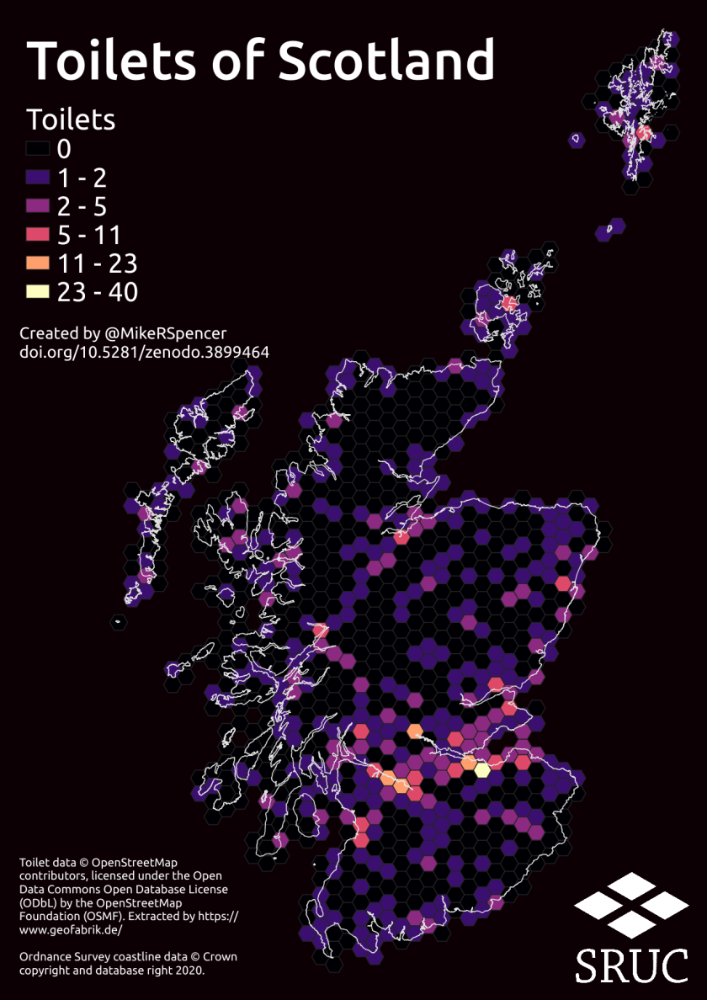
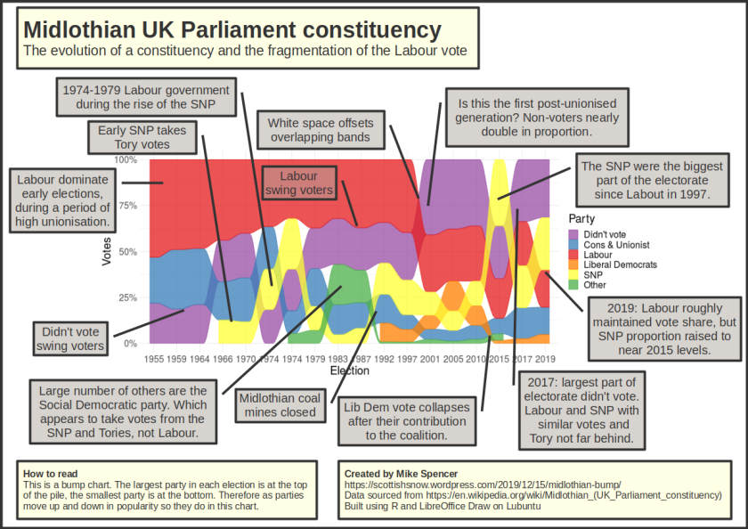
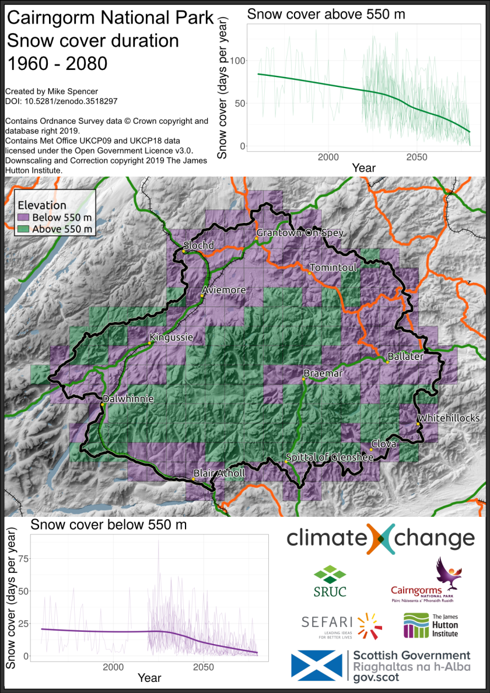

{fig-alt="Logo with the website address and a tagline of human insight for your data needs."}

Navigating the data landscape is hard.
We'd all love to achieve our lofty goals, but the distance to them from our reality seems larger than ever. I help people and organisations bridge the gap between their starting points and goals.

What I bring is the experience to chart a course to an effective solution, and helping you get there in an efficient way.

---

## Services

Pick a time that suits you to talk through the challenge you'd like to solve.

::: {.columns}

::: {.column width="25%"}

Research and analysis

:::

::: {.column width="25%"}

Quality assurance, review and optimisation

:::

::: {.column width="25%"}

Workflows, pipelines and reproducibility

:::

::: {.column width="25%"}

CDO as a service

:::

::::

---

## Highlights

Click on these images to view my previous work.

::: {layout-ncol=3}

{target="_blank"}

{target="_blank"}

{target="_blank"}

:::

